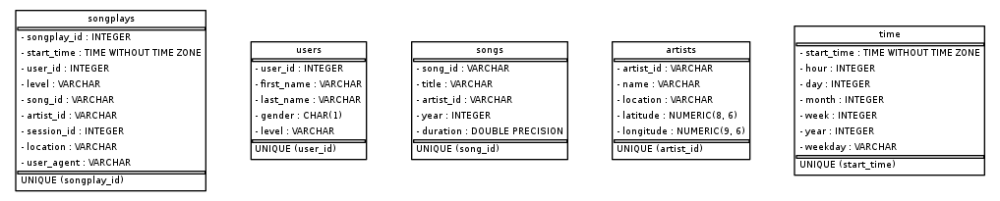

### Project description

The purpose of this database is to provide the startup, Sparkify, with a way to record its data in an organised manner. 
We have a lot of song and log data from multiple files in json format that we need to set up into tables.
Currently these files on their own are very difficult to read and understand. To solve these problems, this project creates a database and
records everything, allowing anyone to read, analyse and update more info if needed.

### Database Design

A Star Schema was used here to simplify and speed up aggregations, so that the user does not have to wait a 
long time to find answers to their analytical questions. In detail:

- songplays: Fact Table that contains the main information
- songs: Dimension table that connects to songplays through song_id; contains only song related data.
- artists: Dimension table that connects to songplays through artist_id; contains artist specific data.
- time: Dimension table that connects to songplays through start_time; records and time and date info.
- users: Dimension table that connects to songplays through user_id; contains user specific data.

### ETL Process

The data is all contained in the aptly named data folder. 
2 types of files are used to record this informationinto our database: songs and logs.
From song files, we record song and artist data, whereas from log files, we record time data and user data.
Finally, we query the song name, artist name and song duration to help us fill in our songplays fact table.

### Project Repository files

2 types of files are used to record this information into our database: songs and logs. 
From song files, we record song and artist data, whereas from log files, we record time data and user data.
Finally, we query the song name, artist name and song duration to help us fill in our songplays fact table

### How To Run the Project

Simply run create_tables.py and then run test.ipynb to make sure no errors pop up and that it! The database has been created

